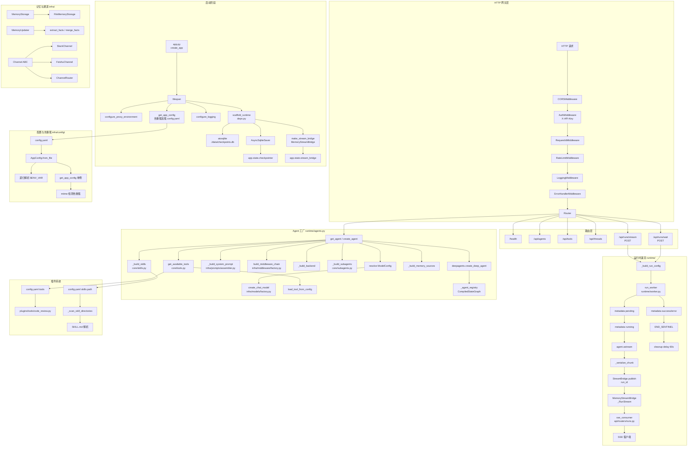

# DeepAgents Scaffold 后端流程图

本图梳理项目后端从启动、HTTP 请求处理、Agent 工厂编译到流式运行时输出的完整流程。

## 1. 总体流程图

## 2. 端到端请求流程

1. **启动**：`app.py:create_app` 组装 FastAPI，lifespan 里加载 `config.yaml`、初始化日志、打开 SQLite checkpointer、创建 `MemoryStreamBridge`，全部挂到 `app.state`。
2. **HTTP 进入**：请求依次经过 CORS → Auth → RequestId → RateLimit → Logging → ErrorHandler。
3. **路由分发**：`/api/runs/stream` 或 `/api/runs/wait` 进入运行处理。
4. **Agent 解析**：`get_agent(assistant_id)` 命中注册表则复用，否则 `create_agent(...)` 按配置现场编译 LangGraph。
5. **构造运行配置**：生成 `thread_id`、`run_id`，注入 `recursion_limit`。
6. **后台 Worker**：`run_worker` 调用 `agent.astream`，把每个 chunk 序列化后发到 `StreamBridge`。
7. **消费端**：
   - `/stream`：`sse_consumer` 从桥读取并返回 SSE。
   - `/wait`：阻塞到 `END_SENTINEL` 后返回最终 checkpoint。
8. **清理**：运行结束后 60 秒触发 `bridge.cleanup(run_id)`。

## 3. 关键文件速查

| 职责 | 文件 |
|------|------|
| FastAPI 入口 | `src/scaffold/api/app.py` |
| 运行时依赖/单例 | `src/scaffold/api/deps.py` |
| Agent 工厂 | `src/scaffold/runtime/agents.py` |
| 工具加载 | `src/scaffold/core/tools.py` |
| 子 Agent | `src/scaffold/core/subagents.py` |
| Skill 扫描 | `src/scaffold/core/skills.py` |
| 模型工厂 | `src/scaffold/infra/models/factory.py` |
| 配置系统 | `src/scaffold/infra/config/app_config.py` |
| 中间件链 | `src/scaffold/infra/middleware/factory.py` |
| StreamBridge | `src/scaffold/runtime/stream_bridge/memory.py` |
| 后台 Worker | `src/scaffold/runtime/worker.py` |
| 主配置 | `config.yaml` |
| 验证配置 | `config.verify.yaml` |
